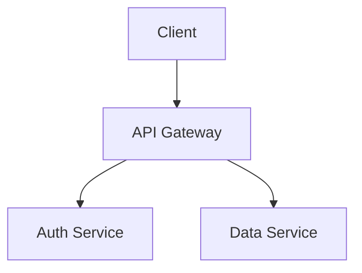
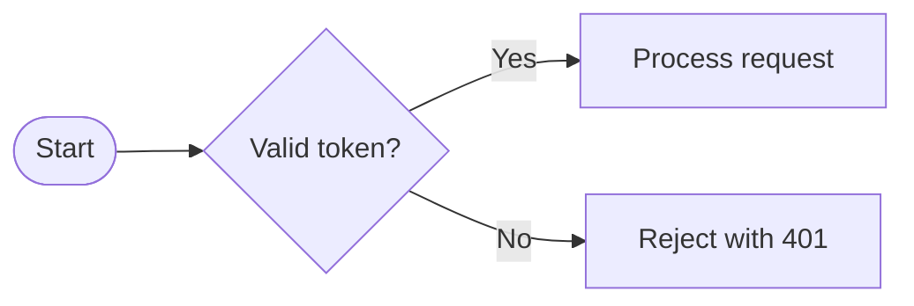
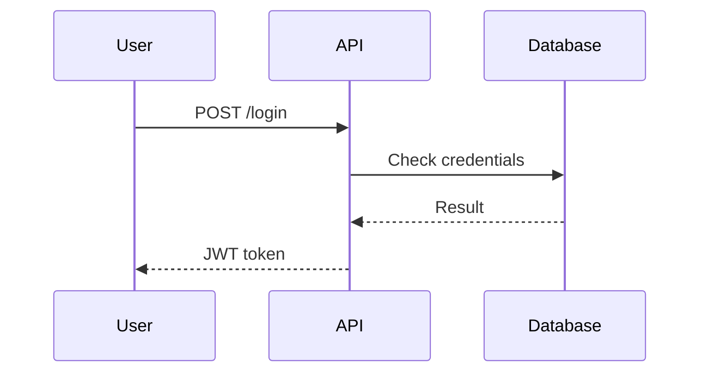

# Markdown Conventions — Writing Excellence & Pedagogy

> **Guiding principle**: every Markdown document is written for a reader who may not necessarily have all the technical knowledge or a global view of the project. The goal is to give them **understanding** first and foremost, **operability** second.

---

## Writing philosophy

### The reader is not you

- Never assume the reader knows an acronym, a tool, or a past decision
- The first occurrence of any technical term **must** be defined or linked to an external resource
- Write as if the document had to stand on its own, even without access to the rest of the repository

### Context before detail

Structure each section using the **Why -> What -> How -> What if** model:

1. **Why** — what problem does this document or section solve?
2. **What** — what exactly are we talking about: definition, scope
3. **How** — steps, concrete examples, commands
4. **What if** — common error cases, alternatives, known limitations

---

## Document structure

### Required header

Every document starts with a context block before any technical content:

```markdown

# Document title

> **Target audience**: [backend developers / entire team / external contributors]
> **Prerequisites**: [short list — e.g. read `CONTRIBUTING.md`, have Node >= 20]
> **Last updated**: [YYYY-MM-DD]
> **Estimated reading time**: [X min]

```

### Table of contents

- Required as soon as the document exceeds **3 level-2 sections (`##`)**
- Generate using GitHub Markdown automatic anchors: `[Title](#title-slug)`
- Place it right after the header, before the first `##`

**GitHub anchor slug generation rules**:

| Transformation | Rule | Example |
| --- | --- | --- |
| Uppercase letters | -> lowercase | `## My Title` -> `#my-title` |
| Spaces | -> hyphens (`-`) | `## My Section` -> `#my-section` |
| Punctuation | removed (except `-` and `_`) | `## What's this?` -> `#whats-this` |
| Accented characters | **preserved** | `## Réponse` -> `#réponse` |
| Markdown formatting | removed (text stays) | `## **Bold** title` -> `#bold-title` |
| Duplicates | suffix `-1`, `-2`... | 2nd `## Intro` -> `#intro-1` |

```markdown

<!-- ✅ Correct anchors -->
[See the response section](#réponse)
[See installation](#installation)

<!-- ❌ Common mistake: do not manually encode accents -->
[See the response section](#r%C3%A9ponse)  <!-- unnecessary - GitHub handles encoding -->

```

### Heading hierarchy

| Level | Usage | Rule |
| --- | --- | --- |
| `#` (H1) | Document title | Only one per file |
| `##` (H2) | Major thematic sections | Main navigation |
| `###` (H3) | Subsections | Breakdown of H2 sections |
| `####` (H4) | Optional details | Avoid if possible — prefer a list |
| `#####`+ | Forbidden | Restructure the content |

---

## Pedagogical writing

### Progressive complexity

- Start with the most common use case (happy path)
- Introduce variants and edge cases **after** the reader understands the nominal flow
- Never open a section with an exception or error case before establishing the normal case

### Analogies and concrete examples

Every abstract or architectural concept must be accompanied by:

1. A **real-life analogy** if the audience may be non-technical
2. A working **code or command example** that is ready to copy and paste
3. An **example of the expected result**: console output, described screenshot, API response

````markdown

<!-- ✅ Good: context + analogy + concrete example -->
## What is a Git worktree?

A worktree is like opening the same binder in two different windows:
you work on two branches at the same time without having to juggle between them.

**Create a worktree:**

```bash

git worktree add /tmp/my-feature -b feat/my-feature

# -> Creates /tmp/my-feature pointing to a new feat/my-feature branch

```

<!-- ❌ Bad: abstract, no example -->
## Worktrees
Worktrees make it possible to manage multiple branches simultaneously.

````

### Technical terms

- **Define on first occurrence**: `CI/CD (continuous integration and continuous deployment)` then `CI/CD` afterward
- **Do not overuse Anglicisms**: prefer "deployment" to "deploy", "continuous integration" to "CI", unless the English technical term is universal in the domain
- Create a `## Glossary` at the end of the document if more than 5 terms are defined

---

## Formatting

### Code blocks

Always specify the **language** for syntax highlighting:

````markdown

```bash          # shell commands

```typescript    # TypeScript/JavaScript code

```yaml          # YAML (CI, configs)

```sql           # SQL queries

```json          # payloads, JSON configs

```mermaid       # diagrams (see dedicated section)

```text          # console output, paths, logs

````

Add a **context comment** above every non-trivial code block:

```markdown

<!-- Runs tests in watch mode only for modified files -->

```bash

npm run test:watch

```

```

### Callouts (visual alerts)

Callouts are a **GitHub Flavored Markdown extension** — they are not part of CommonMark.
They display with distinct icons and colors **only on GitHub.com and GitHub Mobile**.
In Docusaurus, MkDocs, GitLab, or VS Code without an extension, they render as simple blockquotes.

> [!IMPORTANT]
> Callouts **cannot be nested** inside a `<details>`, a list, or another blockquote.
> If you try to nest them, they render as plain text with no formatting.

```markdown

> [!NOTE]
> Useful but non-critical information — the reader can continue without reading it immediately.

> [!TIP]
> Practical advice or a shortcut to move faster.

> [!IMPORTANT]
> Critical information that must not be missed to avoid unexpected behavior.

> [!WARNING]
> Risk of error or data loss — read before taking action.

> [!CAUTION]
> Potentially irreversible action. Check twice before continuing.

```

**Usage rule**: maximum 1-2 callouts per page. Beyond that, they lose their impact.
Do not place callouts back to back — separate them with content.

| Type | GitHub color | When to use it |
| --- | --- | --- |
| `NOTE` | Blue | Useful contextual info but not blocking |
| `TIP` | Green | Shortcut, best practice, expert advice |
| `IMPORTANT` | Purple | Prerequisite or sine qua non condition |
| `WARNING` | Yellow | Risk of error or unexpected behavior |
| `CAUTION` | Red | Irreversible action, possible data loss |

### Tables

- Use tables for **comparisons** and **decision matrices**, not simple lists
- Align columns for readability in the Markdown source
- The first column should be the reading key, never a raw numeric column with no context
- Add a **caption** below the table if the headers are not self-explanatory

### Lists

```markdown

<!-- ✅ Unordered list — same-rank items -->

- Item A
- Item B

<!-- ✅ Ordered list — sequence of steps -->

1. Step 1 — do X
2. Step 2 — do Y (requires step 1 to be complete)

<!-- ❌ Do not mix both without reason -->

1. Item A
- Item B

```

---

## Diagrams (Mermaid)

Prefer a diagram to three explanatory paragraphs for anything involving:
- **Architecture** (services, components, dependencies)
- **Data flow** (request -> processing -> response)
- **Workflow** (states, transitions, decisions)
- **Sequences** (calls between systems)

### Types supported on GitHub

GitHub includes **Mermaid >= 10**. The types below are supported natively:

If you need to confirm the exact renderer version, test directly with a minimal Mermaid block containing `info` on GitHub.

| Mermaid type | Use case | Keyword example |
| --- | --- | --- |
| `flowchart` / `graph` | Architecture, decisions, flows | `flowchart LR` |
| `sequenceDiagram` | Service calls, protocols | `sequenceDiagram` |
| `classDiagram` | Object model, UML | `classDiagram` |
| `stateDiagram-v2` | State machine, lifecycle | `stateDiagram-v2` |
| `erDiagram` | Database schema | `erDiagram` |
| `gantt` | Planning, roadmap | `gantt` |
| `pie` | Proportional distribution | `pie title ...` |
| `gitGraph` | Git branch history | `gitGraph` |
| `journey` | User journey | `journey` |
| `mindmap` | Idea tree | `mindmap` |
| `timeline` | Event chronology | `timeline` |
| `quadrantChart` | 2×2 matrix | `quadrantChart` |
| `xychart-beta` | Bar / line charts | `xychart-beta` |

> [!NOTE]
> Third-party Mermaid plugins can conflict with GitHub rendering. When in doubt, test directly on GitHub.com.

### Examples







### Mermaid rules

- Always add an **implicit title** via a `%%` comment on the first line
- Name nodes in a readable way; avoid `A`, `B`, `C` except in toy examples
- Limit to **8-10 nodes** per diagram — split if more complex
- If the diagram exceeds half a page, move it to a separate `.mmd` file and reference it
- GitHub does not publish a hard size limit, but very large diagrams can fail silently, especially beyond roughly 50 nodes
- Test large diagrams on GitHub.com, not only locally

---

## Navigation and links

### Internal links

```markdown

<!-- ✅ Link to a section in the same file -->
See the [Installation](#installation) section for prerequisites.

<!-- ✅ Link to another repository file (relative path) -->
See the [contribution guide](../../CONTRIBUTING.md).

<!-- ❌ Absolute GitHub links — brittle when forked or renamed -->
https://github.com/org/repo/blob/main/CONTRIBUTING.md

```

### Cross-references

For every concept expanded elsewhere, add a reference:

```markdown

> To go further: [Agent architecture — Orchestrator](agents/orchestrator.agent.md)

```

---

## Length and splitting

| Document | Target length | Split signal |
| --- | --- | --- |
| Main README | 200–500 lines | If > 500 lines -> extract sub-guides |
| Technical guide | 100–400 lines | If > 400 lines -> TOC required + split into files |
| ADR / decision | 50–150 lines | Fixed format — do not exceed |
| Agent instructions | 100–600 lines | Split by domain |
| Changelog | Unlimited | Sections by version — most recent at the top |

---

## Anti-patterns to avoid

| Anti-pattern | Why it is a problem | Alternative |
| --- | --- | --- |
| Dense paragraphs longer than 5 lines | Hard to scan | Split into lists or subsections |
| Vague headings (`Notes`, `Misc`) | Poor navigation | Use descriptive, action-oriented headings |
| Code blocks without context | The reader does not know when or why to run them | Add a comment or intro sentence |
| Instructions in passive voice | Less clear about who does what | Use active voice: `Run X`, `Create file Y` |
| "Refer to the source code" | The reader may not have time or access | Summarize the relevant behavior in the doc |
| Relative dates (`recently`, `soon`) | Becomes outdated instantly | Use absolute dates in `YYYY-MM-DD` |
| Undefined acronyms | Blocking for newcomers | Define them on first occurrence |
| Screenshots without alt text | Inaccessible and not searchable | `` |

---

## markdownlint compliance

The project uses `markdownlint`, commonly through the VS Code extension `DavidAnson.vscode-markdownlint`.
**Every `.md` file created or modified must be free of markdownlint warnings.**

### Most frequently violated rules

| Rule | Description | Fix |
| --- | --- | --- |
| **MD040** | Fenced code blocks without a language | Always specify a language: `` ```bash ``, `` ```typescript ``, `` ```text `` |
| **MD060** | Table separator style | Add spaces: `| --- | --- |` and not `|---|---|` |
| **MD032** | Lists not surrounded by blank lines | Always insert a blank line before and after a list |
| **MD031** | Code blocks not surrounded by blank lines | Always insert a blank line before and after a fenced block |
| **MD022** | Headings not surrounded by blank lines | Always insert a blank line before and after a heading |
| **MD047** | File does not end with a blank line | Always end the file with a final newline |
| **MD012** | Multiple consecutive blank lines | Maximum one blank line between elements |
| **MD009** | Trailing spaces | Remove spaces at the end of lines |
| **MD010** | Tabs | Use spaces, never tabs |
| **MD041** | First element of the file | Must be an H1 heading unless the file starts with YAML frontmatter |

### Correct example — table

```markdown

| Column A | Column B | Column C |
| --- | --- | --- |
| Value 1 | Value 2 | Value 3 |

```

### Correct example — list surrounded by blank lines

```markdown

Introductory text.

- Item A
- Item B
- Item C

Following text.

```

### Correct example — code block with language

````markdown

```text

Console output or content without a specific language

```

````

---

## Validation before commit

Before any commit involving Markdown files, verify:

- [ ] All internal links work: anchors and relative paths
- [ ] All code blocks declare a language
- [ ] Acronyms are defined on first occurrence in the page
- [ ] `[!WARNING]` and `[!CAUTION]` callouts are used for risky actions
- [ ] The document can be read autonomously without implicit external context
- [ ] The context header is present on technical guides
- [ ] No markdownlint warning is present, whether checked in VS Code or via `npx markdownlint-cli2`
