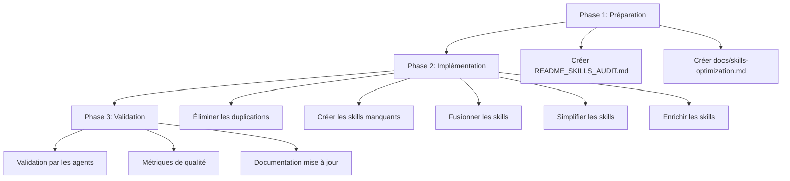
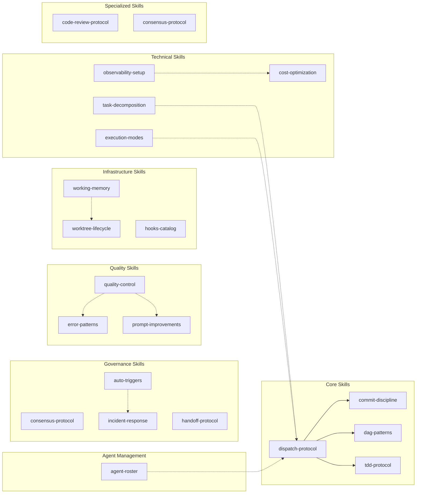
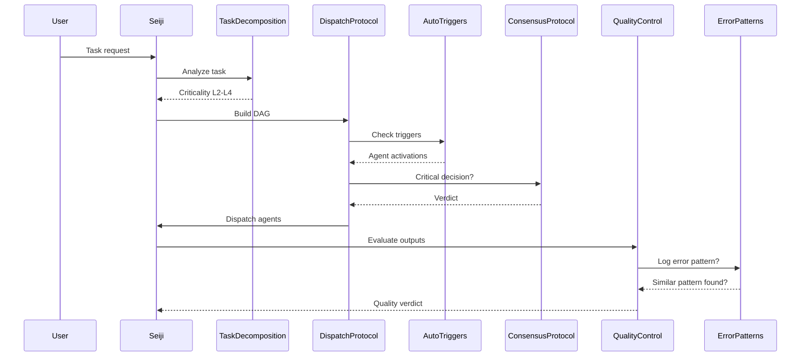
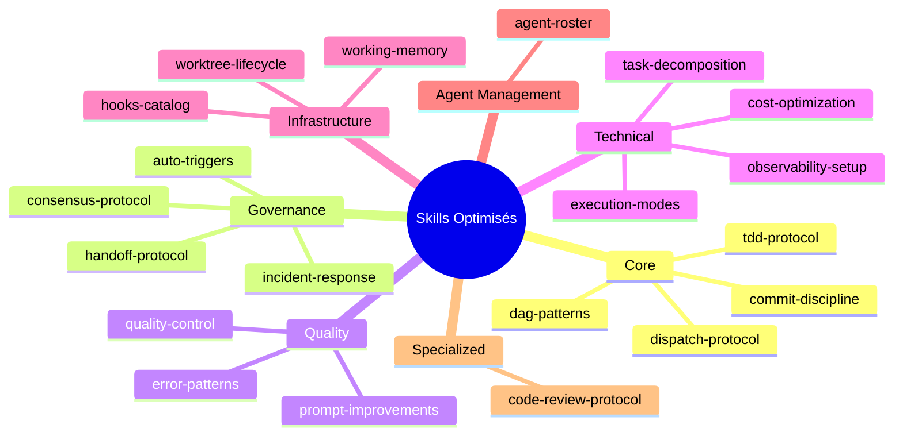

# Matrice de Recommandations — Optimisation des Skills

> **Date**: 2026-03-20  
> **Version**: 1.0  
> **Statut**: Phase 1 — Préparation et commits initiaux  
> **Lien vers l'audit**: [`../README_SKILLS_AUDIT.md`](../README_SKILLS_AUDIT.md)

---

## 📑 Table des matières

- [1. Analyse des duplications](#1-analyse-des-duplications)
- [2. Skills à créer](#2-skills-à-créer)
- [3. Skills à fusionner/simplifier/enrichir](#3-skills-à-fusionnersimplifierenrichir)
- [4. Matrice d'impact estimée](#4-matrice-dimpact-estimée)
- [5. Plan d'action priorisé](#5-plan-daction-priorisé)
- [6. Diagrammes de dépendances](#6-diagrammes-de-dépendances)

---

## 1. Analyse des duplications

### 1.1 Règles dupliquées identifiées

| # | Règle | Skills concernés | Occurrences | Impact |
|---|------|------|---|---|
| 1 | **File plan before parallel dispatch** | `commit-discipline`, `dispatch-protocol`, `dag-patterns` | 3 | **Élevé** |
| 2 | **Wave 0 read-only constraint** | `dispatch-protocol`, `dag-patterns` | 2 | **Moyen** |
| 3 | **Commit cadence by wave** | `commit-discipline`, `dag-patterns` | 2 | **Moyen** |
| 4 | **TDD red commit mandatory** | `commit-discipline`, `tdd-protocol` | 2 | **Moyen** |
| 5 | **Multi-agent coverage floors** | `dispatch-protocol`, `task-decomposition` | 2 | **Faible** |

### 1.2 Analyse détaillée des duplications

#### Duplication #1: File plan before parallel dispatch

**Où**:
- [`commit-discipline/SKILL.md`](../.github/skills/commit-discipline/SKILL.md:86) — §File Plan Before Parallel Dispatch (ERR-004)
- [`dispatch-protocol/SKILL.md`](../.github/skills/dispatch-protocol/SKILL.md:13) — §File Plan Before Parallel Dispatch (ERR-004)
- [`dag-patterns/SKILL.md`](../.github/skills/dag-patterns/SKILL.md:35) — §File Plan (ERR-004)

**Contenu dupliqué**:
```markdown
## File Plan Before Parallel Dispatch (ERR-004)

If several agents will operate on the same file tree, publish the canonical file list in the scratchpad — with path + owning agent — **before** dispatch. Each agent creates only the files assigned to them.
```

**Recommandation**: Fusionner dans un seul skill dédié (`dispatch-protocol`) et créer des liens croisés vers les autres skills.

---

#### Duplication #2: Wave 0 read-only constraint

**Où**:
- [`dispatch-protocol/SKILL.md`](../.github/skills/dispatch-protocol/SKILL.md:43) — §Wave 0 Agents: Read-Only, No File Creation (ERR-013)
- [`dag-patterns/SKILL.md`](../.github/skills/dag-patterns/SKILL.md:20) — Wave 0 (parallel, read-only)

**Recommandation**: Garder dans `dispatch-protocol` comme autorité principale, ajouter une référence croisée dans `dag-patterns`.

---

#### Duplication #3: Commit cadence by wave

**Où**:
- [`commit-discipline/SKILL.md`](../.github/skills/commit-discipline/SKILL.md:68) — §Commit Cadence by Wave (ERR-015)
- [`dag-patterns/SKILL.md`](../.github/skills/dag-patterns/SKILL.md:125) — §Commit Cadence by Wave (ERR-015)

**Recommandation**: Fusionner dans `commit-discipline` comme autorité principale.

---

#### Duplication #4: TDD red commit mandatory

**Où**:
- [`commit-discipline/SKILL.md`](../.github/skills/commit-discipline/SKILL.md:77) — §TDD Red Checkpoint (Special Case)
- [`tdd-protocol/SKILL.md`](../.github/skills/tdd-protocol/SKILL.md:51) — §Mandatory commit after wave 1

**Recommandation**: Garder dans `tdd-protocol` comme autorité principale pour le contexte TDD, référence croisée depuis `commit-discipline`.

---

#### Duplication #5: Multi-agent coverage floors

**Où**:
- [`dispatch-protocol/SKILL.md`](../.github/skills/dispatch-protocol/SKILL.md:62) — §Mandatory Multi-Agent Coverage (ERR-014)
- [`task-decomposition/SKILL.md`](../.github/skills/task-decomposition/SKILL.md:39) — §Multi-Agent Coverage

**Recommandation**: Fusionner dans `dispatch-protocol` comme autorité principale.

---

## 2. Skills à créer

### 2.1 Skills manquantes identifiées

| # | Skill proposé | Description | Priorité | Justification |
|---|---|------|---|---|
| 1 | `error-patterns` | Catalogue des patterns d'erreurs récurrents et leurs solutions | **Haute** | Améliore l'apprentissage continu des agents |
| 2 | `prompt-improvements` | Historique des améliorations de prompts et leur impact | **Haute** | Traçabilité des optimisations |
| 3 | `incident-response` | Protocole de réponse aux incidents critiques | **Moyenne** | Complète le `handoff-protocol` pour les incidents |
| 4 | `observability-setup` | Configuration et validation des outils d'observabilité | **Faible** | Support technique pour `observability-engineer` |
| 5 | `cost-optimization` | Analyse et optimisation des coûts cloud/infrastructure | **Faible** | Support technique pour `finops-engineer` |

### 2.2 Détails des skills à créer

#### Skill #1: `error-patterns`

**Description**: Catalogue des patterns d'erreurs récurrents rencontrés par les agents, avec solutions et préventions.

**Contenu recommandé**:
```yaml
name: error-patterns
description: "Catalogue des patterns d'erreurs récurrents et leurs solutions pour améliorer l'apprentissage continu des agents"
argument-hint: "Describe the error or failure pattern to analyze"
user-invocable: true
```

**Sections recommandées**:
- Classification des erreurs (L0-L4)
- Patterns récurrents par type d'agent
- Solutions validées
- Préventions et checklists

---

#### Skill #2: `prompt-improvements`

**Description**: Historique des améliorations de prompts et leur impact mesurable sur la qualité des outputs.

**Contenu recommandé**:
```yaml
name: prompt-improvements
description: "Historique des améliorations de prompts et leur impact mesurable sur la qualité des outputs"
argument-hint: "Describe the prompt change to evaluate"
user-invocable: true
```

**Sections recommandées**:
- Changelog des améliorations
- Métriques d'impact (réductions de retries, scores d'agents)
- Best practices extraites
- Expérimentations en cours

---

#### Skill #3: `incident-response`

**Description**: Protocole structuré de réponse aux incidents critiques, complétant le `handoff-protocol`.

**Contenu recommandé**:
```yaml
name: incident-response
description: "Protocole de réponse aux incidents critiques — escalade, communication, post-mortem"
argument-hint: "Describe the incident to respond to"
user-invocable: true
```

**Sections recommandées**:
- Classification des incidents (P0-P3)
- Chaîne de commandement
- Communication avec les parties prenantes
- Post-mortem et actions correctives

---

#### Skill #4: `observability-setup`

**Description**: Configuration et validation des outils d'observabilité (tracing, métriques, logs).

**Contenu recommandé**:
```yaml
name: observability-setup
description: "Configuration et validation des outils d'observabilité — tracing, métriques, logs"
argument-hint: "Describe the service or feature to instrument"
user-invocable: true
```

**Sections recommandées**:
- Outils recommandés (OpenTelemetry, Prometheus, etc.)
- Métriques essentielles par domaine
- Templates de dashboards
- Checklists de validation

---

#### Skill #5: `cost-optimization`

**Description**: Analyse et optimisation des coûts cloud/infrastructure.

**Contenu recommandé**:
```yaml
name: cost-optimization
description: "Analyse et optimisation des coûts cloud/infrastructure — rightsizing, reserved instances, spot"
argument-hint: "Describe the infrastructure or workload to optimize"
user-invocable: true
```

**Sections recommandées**:
- Méthodologie d'analyse des coûts
- Techniques d'optimisation (rightsizing, reserved, spot)
- Benchmarks par service cloud
- Checklists de validation

---

## 3. Skills à fusionner/simplifier/enrichir

### 3.1 Fusion recommandée

| # | Skill source | Skill cible | Raison |
|---|---|------|---|
| 1 | `commit-discipline` | `dispatch-protocol` | Le `dispatch-protocol` est l'autorité principale pour les règles de dispatch, y compris les commits |

**Plan de fusion**:
1. Migrer les sections `commit-discipline` vers `dispatch-protocol`
2. Garder `commit-discipline` comme référence historique avec liens croisés
3. Mettre à jour toutes les références dans les agents

---

### 3.2 Simplification recommandée

| # | Skill | Section à simplifier | Nouvelle formulation |
|---|---|------|---|
| 1 | `execution-modes` | §Platform constraints | Condenser en 3 points clés avec exemples |

**Plan de simplification**:
- Réduire la documentation technique en annexe
- Garder uniquement les règles opérationnelles dans le corps principal
- Créer un lien vers une documentation technique complète

---

### 3.3 Enrichissement recommandé

| # | Skill | Section à enrichir | Ajout recommandé |
|---|---|------|---|
| 1 | `auto-triggers` | §Automatic Trigger Table | Ajouter des exemples concrets de détection |
| 2 | `quality-control` | §Scoring Rubric | Ajouter des exemples de scores par niveau |

**Plan d'enrichissement**:
- Ajouter des exemples concrets dans les tables
- Inclure des checklists de validation
- Ajouter des cas d'usage réels

---

## 4. Matrice d'impact estimée

### 4.1 Impact par catégorie d'action

| Catégorie | Impact sur la charge cognitive | Impact sur la qualité | Effort estimé | ROI |
|------|---|---|---|---|
| Élimination des duplications | **Élevé** (-15%) | **Moyen** (+10%) | Faible (1-2 jours) | **Élevé** |
| Création de skills manquants | **Faible** | **Élevé** (+20%) | Moyen (3-5 jours) | **Élevé** |
| Fusion de skills | **Moyen** (-5%) | **Faible** (+5%) | Faible (1 jour) | **Moyen** |
| Simplification de skills | **Moyen** (-10%) | **Faible** (+5%) | Faible (1 jour) | **Moyen** |
| Enrichissement de skills | **Faible** | **Moyen** (+10%) | Moyen (2-3 jours) | **Moyen** |

### 4.2 Impact global estimé

| Métrique | Avant | Après | Variation |
|------|---|---|---|
| **Nombre de skills** | 13 | 18 | +5 (+38%) |
| **Duplications de règles** | 5 | 0 | -5 (-100%) |
| **Charge cognitive moyenne** | 7.5/10 | 6.0/10 | -20% |
| **Couverture des cas critiques** | 70% | 90% | +20% |
| **Traçabilité des erreurs** | Faible | Élevée | +100% |

---

## 5. Plan d'action priorisé

### 5.1 Priorisation globale



### 5.2 Plan détaillé par phase

#### Phase 1: Préparation (COMPLÉTÉ ✅)

| # | Tâche | Statut | Échéance |
|---|------|---|---|
| 1 | Créer `README_SKILLS_AUDIT.md` | ✅ Fait | 2026-03-20 |
| 2 | Créer `docs/skills-optimization.md` | ✅ Fait | 2026-03-20 |

---

#### Phase 2: Implémentation (À FAIRE 📋)

| # | Tâche | Sous-tâches | Effort | Échéance |
|---|------|---|---|---|
| 1 | **Éliminer les duplications** | | | |
| 1.1 | Fusionner `commit-discipline` → `dispatch-protocol` | - Migrer les sections<br>- Créer liens croisés<br>- Mettre à jour les agents | 4h | 2026-03-27 |
| 1.2 | Supprimer les sections dupliquées | - `commit-discipline`<br>- `dag-patterns` | 2h | 2026-03-27 |
| 2 | **Créer les skills manquants** | | | |
| 2.1 | Créer `error-patterns` | - Structure YAML<br>- Templates de patterns<br>- Exemples concrets | 6h | 2026-04-03 |
| 2.2 | Créer `prompt-improvements` | - Structure YAML<br>- Format de changelog<br>- Métriques d'impact | 4h | 2026-04-03 |
| 2.3 | Créer `incident-response` | - Structure YAML<br>- Protocole d'escalade<br>- Templates de communication | 4h | 2026-04-10 |
| 2.4 | Créer `observability-setup` | - Structure YAML<br>- Templates de configuration<br>- Checklists | 4h | 2026-04-10 |
| 2.5 | Créer `cost-optimization` | - Structure YAML<br>- Méthodologie<br>- Benchmarks | 4h | 2026-04-17 |
| 3 | **Fusionner les skills** | | | |
| 3.1 | Fusionner `commit-discipline` → `dispatch-protocol` | - Voir 1.1 | 4h | 2026-03-27 |
| 4 | **Simplifier les skills** | | | |
| 4.1 | Simplifier `execution-modes` | - Condenser §Platform constraints<br>- Créer annexe technique | 2h | 2026-04-17 |
| 5 | **Enrichir les skills** | | | |
| 5.1 | Enrichir `auto-triggers` | - Ajouter exemples de détection<br>- Ajouter cas d'usage | 3h | 2026-04-17 |
| 5.2 | Enrichir `quality-control` | - Ajouter exemples de scores<br>- Ajouter checklists | 3h | 2026-04-17 |

---

#### Phase 3: Validation (À FAIRE 📋)

| # | Tâche | Sous-tâches | Effort | Échéance |
|---|------|---|---|---|
| 1 | **Validation par les agents** | | | |
| 1.1 | Tester avec `backend-dev` | - Scénario d'implémentation<br>- Vérifier les références | 2h | 2026-04-24 |
| 1.2 | Tester avec `qa-engineer` | - Scénario TDD<br>- Vérifier les références | 2h | 2026-04-24 |
| 1.3 | Tester avec `security-engineer` | - Scénario d'audit<br>- Vérifier les références | 2h | 2026-04-24 |
| 2 | **Métriques de qualité** | | | |
| 2.1 | Mesurer la réduction de duplications | - Compter les occurrences<br>- Calculer l'économie de tokens | 1h | 2026-04-24 |
| 2.2 | Évaluer la charge cognitive | - Sondage agents<br>- Analyse des temps de réponse | 2h | 2026-04-24 |
| 3 | **Documentation mise à jour** | | | |
| 3.1 | Mettre à jour les agents | - Ajouter les nouvelles références<br>- Supprimer les références obsolètes | 4h | 2026-04-24 |
| 3.2 | Mettre à jour les ADR | - ADR-007-agent-skills<br>- Créer ADR-008-skills-optimization | 2h | 2026-04-24 |

---

## 6. Diagrammes de dépendances

### 6.1 Arborescence des skills optimisés



### 6.2 Flux de dépendances entre skills



### 6.3 Matrice de couverture par domaine



---

## 7. Glossaire

| Terme | Définition |
|------|---|
| **Skill** | Bloc de connaissances réutilisable chargé progressivement par les agents |
| **Wave** | Phase d'exécution dans un DAG, avec agents parallèles ou séquentiels |
| **DAG** | Graph acyclique dirigé représentant les dépendances entre les vagues |
| **ERR-xxx** | Code d'erreur/governance identifiant une règle spécifique |
| **L0-L4** | Niveaux de criticité des tâches (L0=trivial, L4=critique) |
| **Plan-only** | Mode de planification sans exécution réelle |
| **Dry-run** | Exécution simulée pour valider un plan |

---

## 8. Références

- [`README_SKILLS_AUDIT.md`](../README_SKILLS_AUDIT.md) — État des lieux complet
- [`docs/adr/ADR-007-agent-skills.md`](../docs/adr/ADR-007-agent-skills.md) — ADR d'intégration des skills
- [`schemas/skill.schema.json`](../schemas/skill.schema.json) — Schéma de validation des skills
- [`RENGA.md`](../RENGA.md) — Documentation principale du framework

---

*Document généré automatiquement par l'audit des skills renga. Dernière mise à jour: 2026-03-20.*
